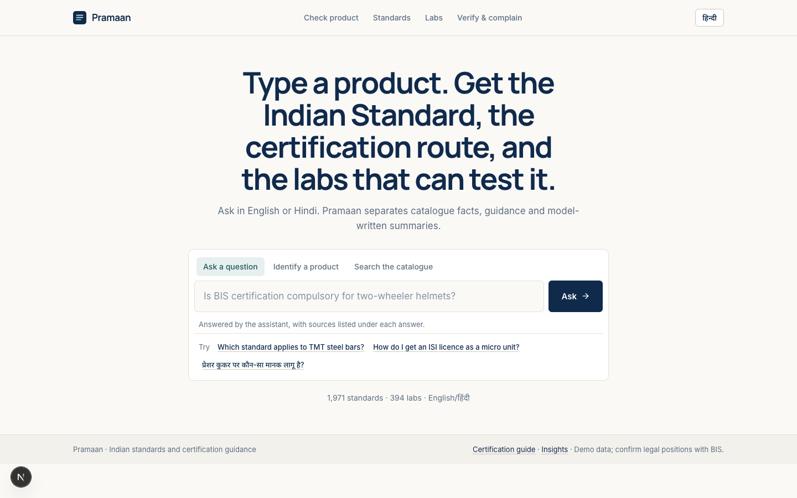
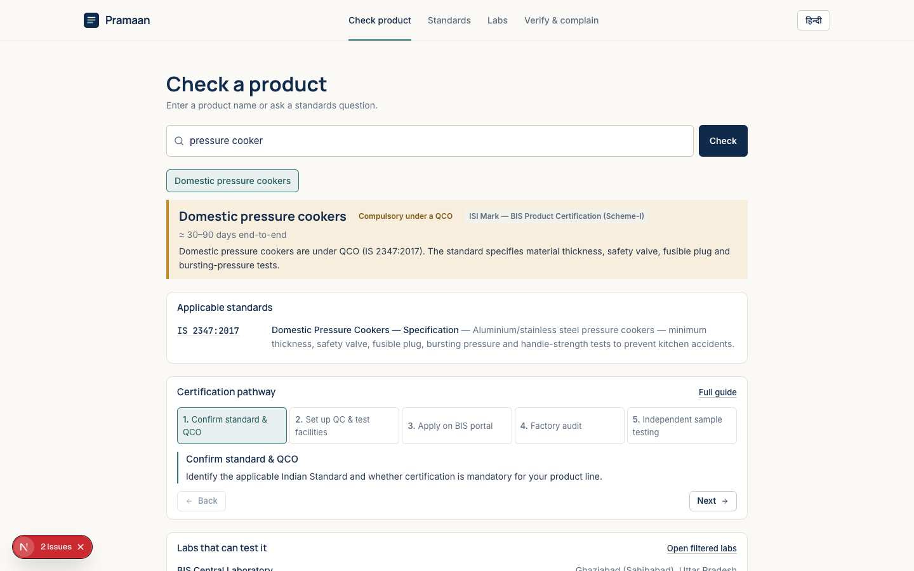

# Pramaan

Pramaan helps manufacturers and consumers find Indian Standards and understand BIS certification. Ask about a product or process to see matching catalogue records, certification guidance and relevant testing labs. The app includes English/Hindi support, a local embedded GGUF language model, a standards catalogue, certification guide, lab directory, mark checker and optional label scanning.





## Quick start

```bash
npm install --legacy-peer-deps
cp .env.example .env
npm run model:download
npm run dev
```

Open [http://localhost:3000](http://localhost:3000). `npm run ai:warmup` can preload the model before a demo.

The assistant retrieves standards, guides and lab records from Pramaan's database before forming an answer. Catalogue details and citations are rendered from those records; the model is used for short explanatory text, not as the source of official facts. Some common flows, including CRS application guidance and HUID checks, use curated deterministic responses.

## Use a larger embedded model

The included Gemma 3 270M GGUF is intentionally small. For better model-written summaries, set `AI_MODEL_URL` in `.env` to a direct instruct-tuned GGUF URL (for example Qwen2.5-0.5B-Instruct or 1.5B), run `npm run model:download`, and restart the app. You can instead point `AI_GGUF_PATH` at an existing local GGUF file.

## Demo data

The standards, laboratory directory and licence registry are curated demonstration data, not a live connection to BIS. Licence/HUID results are not official verification. Confirm current standards, requirements and licence status through the BIS portal or BIS Care app before relying on them. The embedded model can make mistakes; check its explanation against the cited catalogue records.
